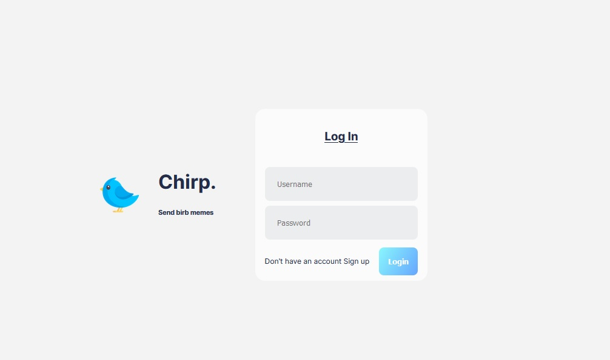
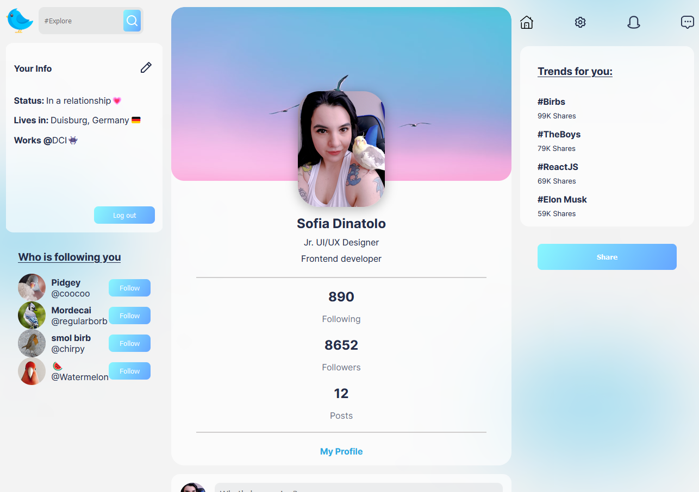

In the project directory, you can run:

### `yarn start`

Runs the app in the development mode.\
Open [http://localhost:3000](http://localhost:3000) to view it in your browser.

---
# Chirp-website

## Project overview

---

## Project goals

- Create a social media app

---

## Resources used:

- [React](https://facebook.github.io/react/)
- [Freepik](https://www.freepik.com/)
- [Google Fonts](https://www.fonts.google.com/)
- [Mantine](https://mantine.dev/core/modal/)
- [Webgradients](https://webgradients.com/)

---
